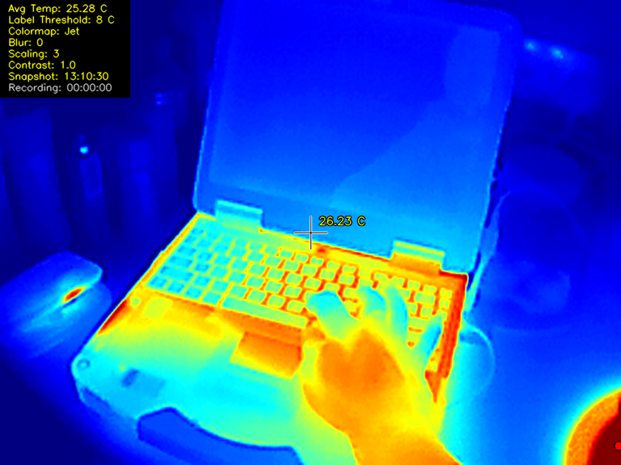
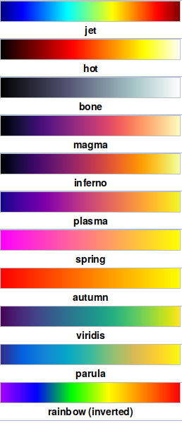

# PyThermalcam
Python Software to use the Topdon TC001 Thermal Camera on Linux and the Raspberry Pi

Huge kudos to LeoDJ on the EEVBlog forum for reverse engineering the image format from these kind of cameras (InfiRay P2 Pro) to get the raw temperature data!
https://www.eevblog.com/forum/thermal-imaging/infiray-and-their-p2-pro-discussion/200/
Check out Leo's Github here: https://github.com/LeoDJ/P2Pro-Viewer/tree/main

## Introduction

This is a quick and dirty Python implimentation of Thermal Camera software for the Topdon TC001!
(https://www.amazon.co.uk/dp/B0BBRBMZ58)
No commands are sent the the camera, instead, we take the raw video feed, do some openCV magic, and display a nice heatmap along with relevant temperature points highlighted.

This program, and associated information is Open Source (see Licence), but if you have gotten value from these kinds of projects and think they are worth something, please consider donating: https://paypal.me/leslaboratory?locale.x=en_GB 

This readme is accompanied by youtube videos. Visit my Youtube Channel at: https://www.youtube.com/leslaboratory

## Features

Tested on Debian all features are working correctly This has been tested on the Pi However a number of workarounds are implemented! Seemingly there are bugs in the compiled version of openCV that ships with the Pi!!

The following features have been implemented:

- Bicubic interpolation to scale the small 256*192 image to something more presentable! Available scaling multiplier range from 1-5 (Note: This will not auto change the window size on the Pi (openCV needs recompiling), however you can manually resize). Optional blur can be applied if you want to smooth out the pixels. 
- Fullscreen / Windowed mode (Note going back to windowed  from fullscreen does not seem to work on the Pi! OpenCV probably needs recompiling!).
- False coloring of the video image is provided. the avilable colormaps are listed on the right.
- Variable Contrast.
- Average Scene Temperature.
- Center of scene temperature monitoring (Crosshairs).
- Floating Maximum and Minimum temperature values within the scene, with variable threshold.
- Video recording is implemented (saved as AVI in the working directory).
- Snapshot images are implemented (saved as PNG in the working directory).

The current settings are displayed in a box at the top left of the screen (The HUD):

- Avg Temperature of the scene
- Label threshold (temperature threshold at which to display floating min max values)
- Colormap
- Blur (blur radius)
- Scaling multiplier
- Contrast value
- Time of the last snapshot image
- Recording status

## Dependencies

Python3 OpenCV Must be installed:

Run: **sudo apt-get install python3-opencv**

## Running the Program

In src you will find two programs:

**tc001-RAW.py** Just demonstrates how to grab raw frames from the Thermal Camera, a starting point if you want to code your own app.

**tc001v4.2.py** The main program!

To run it plug in the thermal camera and run: **v4l2-ctl --list-devices** to list the devices on the system. You will need its device number.

Assuming the device number is 0 simply issue: **python3 tc001v4.2.py --device 0**

**Note**
This is in Alpha. No error checking has been implemented yet! So if the program tries to start, then quits, either a camera is not connected, or you have entered the wrong device number.

Error checking will be implemented after I refactor and optimize the code!

## Key Bindings

- a z: Increase/Decrease Blur

- s x: Floating High and Low Temp Label Threshold'

- d c: Change Interpolated scale.(Note: This will not change the window size on the Pi!)

- f v: Contrast

- q w: Fullscreen Windowed. (Note: Going back to windowed does not seem to work on the Pi!)

- r t: Record and Stop

- m : Cycle through ColorMaps
  
- h : Toggle HUD

## TODO:

- No Error checking is implemented!
- No attempt has been made to refactor the code (Yet!)!
- The code would benefit from threading especially on low speed but multicore architectures like the Pi!
- I might add a graph.
- I may add the ability to arbitrarily measure points.

